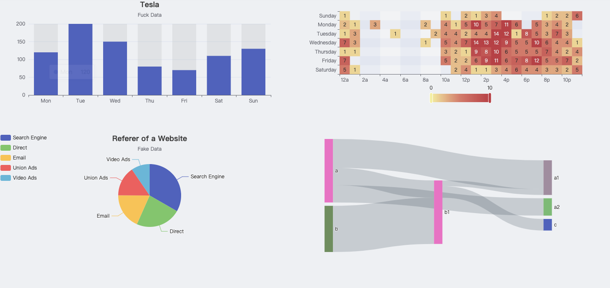

<h1 align="center">echart-for-rc</h1>

<div align="center">

一个简单的 echart react 封装.

包含提供了一些具体图形的模板.

</div>

[](example)

简体中文 | [English](./README.md)

## ✨ 特性

- 🛡 完全使用 TypeScript 编写
- 🌈 使用 __React Hook__ 实现（不支持 React v16.8.0 之前的版本）
- 📦 为了更好的 __Echarts__ 类型提示，基于 Echarts v5 开发（不支持以前的 Echarts 版本）
- 🎨 会根据 __Options__ 中的 __attributes__ 自动决定 当前需要引入的 __extensions__，尽可能的优化 bundle size.
- ⚙️ 提供了react style 的 event 绑定方式


## 🔨 示例

```jsx
import { Bar } from 'echart-for-rc';

const App = () => (
  <>
    <Bar 
      options={{
        title: {
          text: 'Tesla',
          subtext: 'Fuck Data',
          left: 'center',
        },
        tooltip: {
          trigger: 'item',
        },
        xAxis: {
          type: 'category',
          data: ['Mon', 'Tue', 'Wed', 'Thu', 'Fri', 'Sat', 'Sun'],
        },
        yAxis: {
          type: 'value',
        },
        series: [
          {
            data: [120, 200, 150, 80, 70, 110, 130],
            type: 'bar',
            showBackground: true,
            backgroundStyle: {
              color: 'rgba(180, 180, 180, 0.2)',
            },
          },
        ],
      }}
    />
  </>
);
```

or

```tsx
import { Bar } from 'echart-for-rc';
import type { BarOptions } from 'echart-for-rc';

const App = () => {

  const options: BarOptions = {
    title: {
      text: 'Tesla',
      subtext: 'Fuck Data',
      left: 'center',
    },
    tooltip: {
      trigger: 'item',
    },
    xAxis: {
      type: 'category',
      data: ['Mon', 'Tue', 'Wed', 'Thu', 'Fri', 'Sat', 'Sun'],
    },
    yAxis: {
      type: 'value',
    },
    series: [
      {
        data: [120, 200, 150, 80, 70, 110, 130],
        type: 'bar',
        showBackground: true,
        backgroundStyle: {
          color: 'rgba(180, 180, 180, 0.2)',
        },
      },
    ],
  }
  return (
    <Bar 
      options={options}
    />
  )
};
```

## TypeScript

`react-echart` 基于最新稳定版本的 TypeScript（>=4.6.3），请确保项目中使用匹配的版本.


## ⌨️ 本地开发

克隆到本地开发:

```bash
$ git clone git@github.com:jay0815/react-echart.git
$ cd react-echart
$ pnpm install
```

